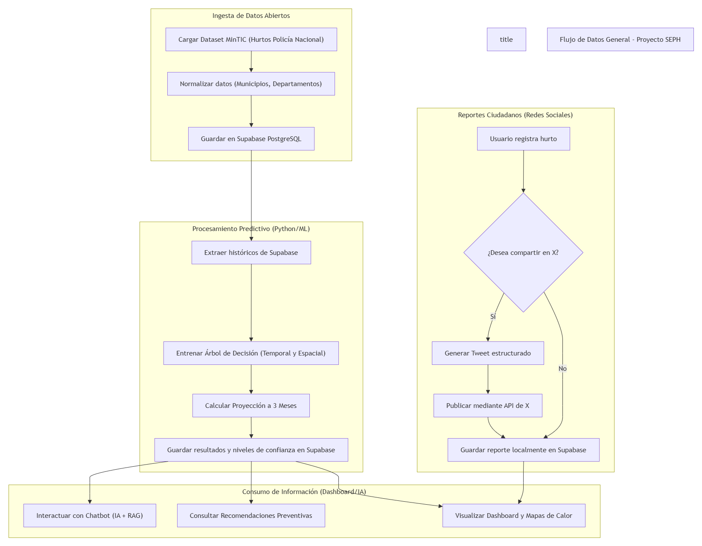
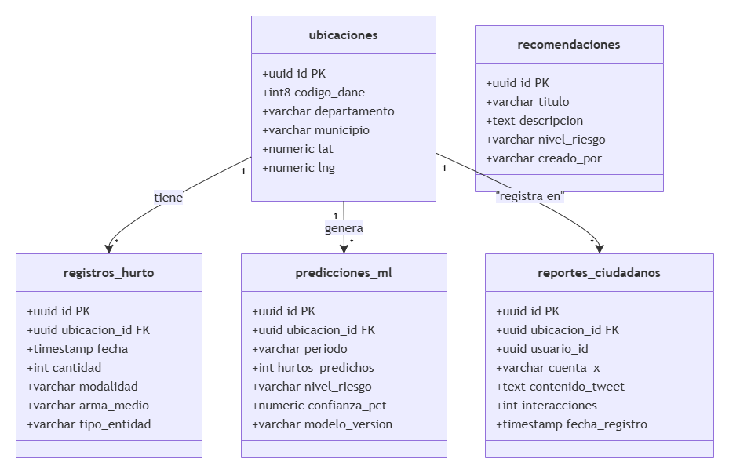
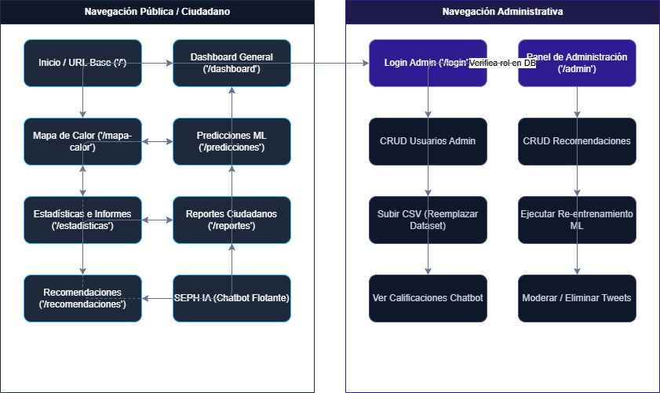
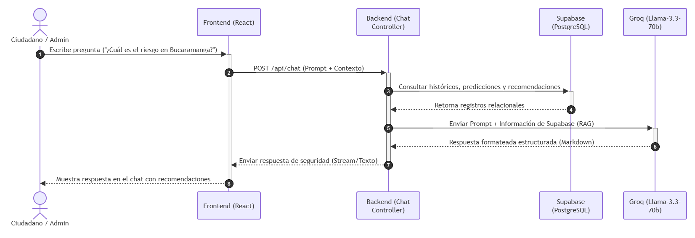
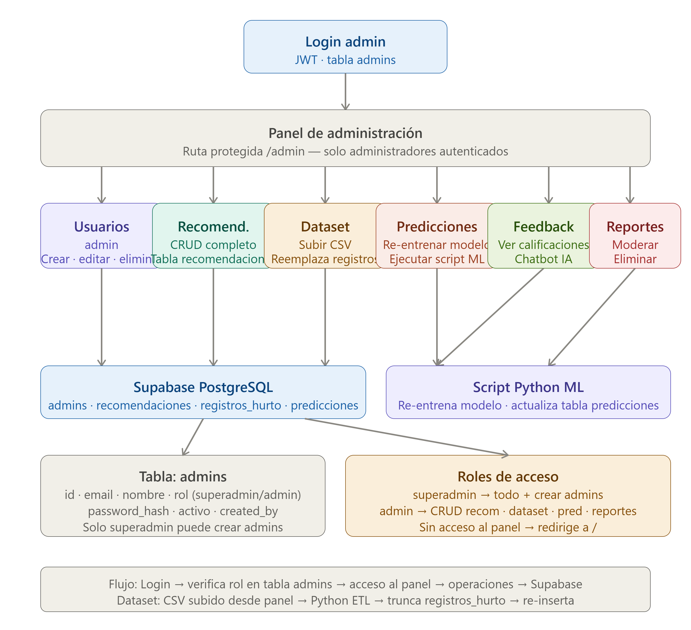

# Arquitectura del sistema

## 1. Stack tecnológico

| Componente | Tecnología | Función |
|---|---|---|
| Persistencia de datos | PostgreSQL en Supabase | Fuente de verdad única: dataset normalizado, predicciones, recomendaciones, reportes y administración. |
| Procesamiento predictivo | Python (scikit-learn — Árbol de Decisión) | Entrenamiento del modelo, cálculo de proyecciones a 3 meses y niveles de confianza. |
| Asistente conversacional | Groq API (`llama-3.3-70b-versatile`) + prompt de sistema con conocimiento embebido | Respuestas de SEPH basadas en cifras agregadas y recomendaciones escritas en el prompt (no consulta Supabase por pregunta — ver `chatbot_rag_matriz.md`). |
| Redes sociales | API de X (proyección Facebook/Instagram) | Publicación y difusión de reportes ciudadanos de hurto. |
| Autenticación administrativa | JWT + tabla `admins` | Control de acceso por rol (`superadmin` / `admin`) a la ruta `/admin`. |

## 2. Flujo de datos general

Ingesta de datos abiertos → normalización → almacenamiento en Supabase → procesamiento predictivo (Python/ML) → consumo desde dashboard, chatbot y recomendaciones. En paralelo, el módulo de reportes ciudadanos captura evidencia comunitaria y la persiste en la misma base de datos.

## 3. Modelo de datos

Diseño dimensional: tabla de hechos `registros_hurto` relacionada con las dimensiones `ubicaciones`, `tipos_hurto` y `armas_medios`; tablas de resultados (`predicciones`, `recomendaciones`, `alertas`); y tablas de producto ciudadano/administrativo (`reportes_ciudadanos`, `interacciones`, `admins`, `ingestas_dataset`). Detalle campo a campo en [`data_dictionary.md`](data_dictionary.md).

## 4. Navegación de la plataforma

La plataforma se divide en dos árboles de navegación sobre la misma base de datos:

- **Pública/ciudadana:** inicio → dashboard general → mapa de calor (histórico/predictivo) → estadísticas e informes → reportes ciudadanos → recomendaciones → chatbot flotante SEPH.
- **Administrativa:** login (JWT contra `admins`) → panel de administración → gestión de usuarios, recomendaciones, dataset, predicciones, feedback del chatbot y moderación de reportes.

## 4.1 Interacción con el chatbot (diagrama de secuencia)

Complementa el flujo descrito en [`chatbot_rag_matriz.md`](chatbot_rag_matriz.md): pregunta del ciudadano → historial de conversación + prompt de sistema con conocimiento embebido → respuesta generada por Groq. **Nota:** el diagrama fue creado originalmente asumiendo una arquitectura RAG; revisar si el diagrama de secuencia en `Diagramas/` todavía muestra un paso de "consulta a Supabase" antes de la respuesta — de ser así, el diagrama no coincide con el código real y debería actualizarse o aclararse en la sustentación.

## 5. Panel administrativo y control de roles

- **`superadmin`:** acceso total, incluida la creación de nuevos administradores.
- **`admin`:** operación de recomendaciones, dataset, predicciones y reportes, sin gestión de usuarios administrativos.
- **Flujo de dataset:** CSV subido desde el panel → ETL en Python → truncado de `registros_hurto` → re-inserción → re-entrenamiento del modelo → actualización de `predicciones`.

> Nota: los diagramas de este documento se referencian desde `Diagramas/`, que es la carpeta fuente única de diagramas del repositorio (incluye también el código Mermaid original de cada uno). `docs/img/` fue eliminada para evitar duplicidad.

## 6. Consideraciones de despliegue en zonas de baja conectividad

La arquitectura se apoya en procesamiento por lotes (carga mensual del dataset) y en una base de datos gestionada (Supabase) accesible vía API REST, lo que permite que el consumo desde el frontend sea liviano. Esto facilita adaptar el dashboard a contextos territoriales con conectividad limitada, priorizando vistas estáticas o cacheadas del mapa de calor cuando el ancho de banda es reducido.
